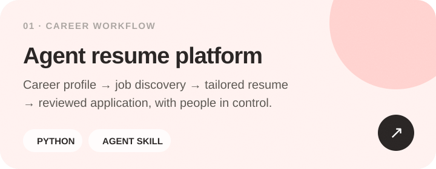
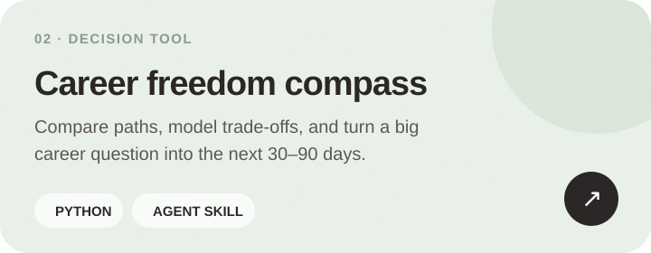
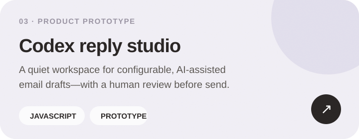
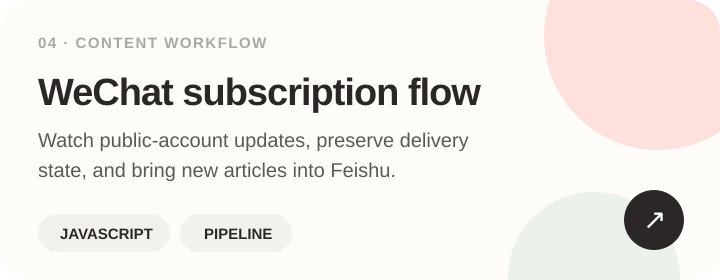

<picture>
  <source media="(max-width: 600px)" srcset="./assets/softly-hero-mobile.svg">
  
</picture>

  <a href="#selected-work">Selected work</a> ·
  <a href="#how-i-work">How I work</a> ·
  <a href="mailto:zhukeb@kean.edu">Say hello</a>

## A little about me

I'm **Bacy Zhu**, a product-minded builder based in Zhejiang, China. I like turning messy human workflows into calm, testable tools—lately around AI agents, career decisions, recruiting operations, and content systems.

<kbd>Open to product internships</kbd> &nbsp; <kbd>Building with AI agents</kbd> &nbsp; <kbd>Always learning</kbd>

## Selected work

## My working palette

`Product discovery` · `Workflow design` · `Rapid prototyping` · `AI agents` · `Python` · `JavaScript / TypeScript` · `Java`

## How I work

  
<strong>Start with the real workflow</strong>

   
  I map the people, decisions, handoffs, and failure points before choosing the interface or stack.

  
<strong>Ship the smallest useful loop</strong>

   
  I prefer one testable end-to-end path over a large speculative system, then learn from real use.

  
<strong>Keep people in control</strong>

   
  For consequential actions—applications, messages, or personal data—I design explicit review and confirmation points.

## Let's make complicated things feel lighter

If you're building thoughtful AI products or better tools for human work, I'd love to compare notes.

[Email me](mailto:zhukeb@kean.edu) · [Explore all repositories](https://github.com/Zkkk-web?tab=repositories)

Designed with warm pastels, soft edges, and a little grain. Built entirely with GitHub-native Markdown and self-hosted SVG.
