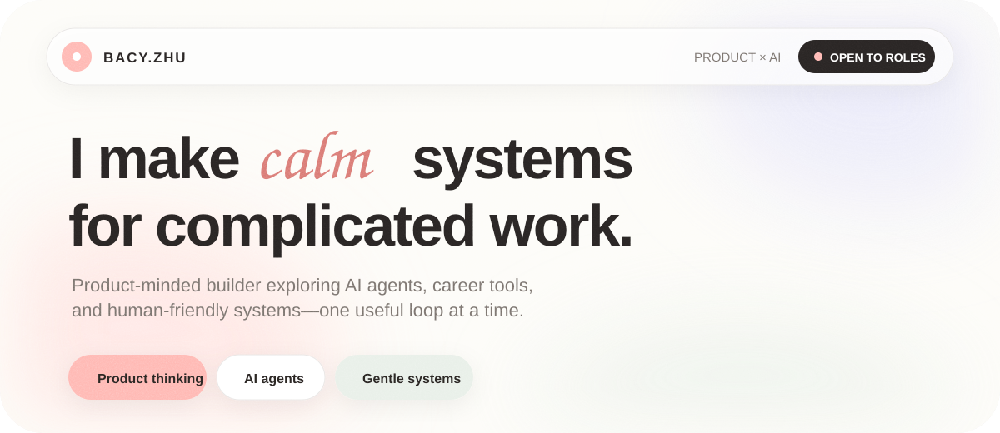
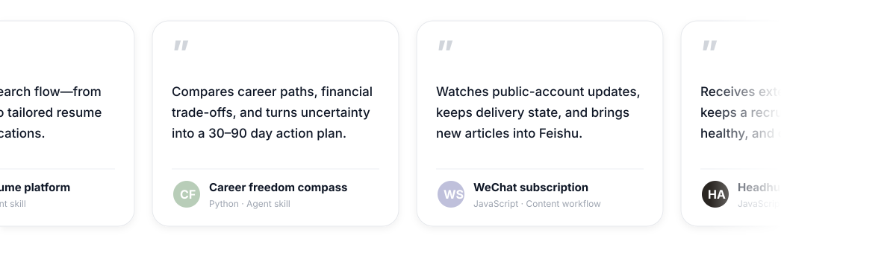

<picture>
  <source media="(max-width: 600px)" srcset="./assets/softly-hero-mobile.svg">
  
</picture>

## A little about me

I'm **Bacy Zhu**, a product-minded builder based in Zhejiang, China. I like turning messy human workflows into calm, testable tools—lately around AI agents, career decisions, recruiting operations, and content systems.

<kbd>Open to product internships</kbd> &nbsp; <kbd>Building with AI agents</kbd> &nbsp; <kbd>Always learning</kbd>

## Selected work

## Find me

If you're building thoughtful AI products or better tools for human work, I'd love to compare notes.

[Email me](mailto:zhukeb@kean.edu) · [Explore all repositories](https://github.com/Zkkk-web?tab=repositories)
